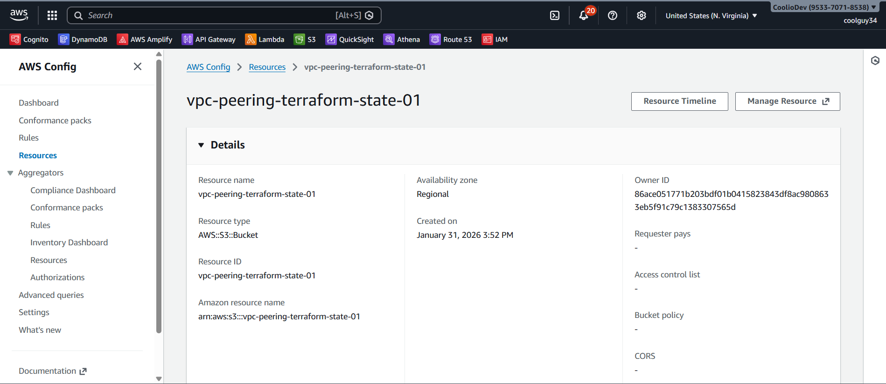
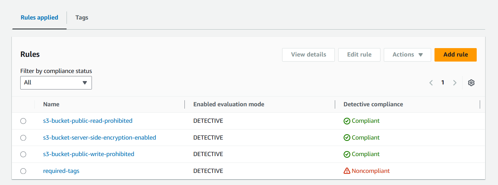

## 🛡️ AWS Policy and Governance Setup Using Terraform

### 📌 Project Overview:

This project demonstrates how to implement AWS security governance and compliance using Terraform. AWS Config is used to continuously record and evaluate AWS resource configurations against predefined compliance rules.

---

### Live Demo:

The S3 bucket named **vpc-peering-terraform-state-01** meets all three security rules (public read blocked, public write blocked, and encryption enabled) but is flagged as non-compliant due to missing required tags.

---

### Problem:

In a growing AWS environment, managing security, compliance, and governance manually becomes risky and error-prone. Without automated controls, resources may be created without encryption, proper tagging, MFA enforcement, or public access restrictions—leading to security vulnerabilities and compliance failures. The challenge is to continuously monitor AWS resources, enforce security best practices, and clearly identify compliant and non-compliant resources in a scalable and repeatable way.

---

### 🔐 Key Features:

- Continuous configuration monitoring using AWS Config
- Automated compliance checks for:
  - S3 public read and write access
  - S3 server-side encryption
  - EBS volume encryption
  - Required resource tagging
  - Root account MFA enforcement
- IAM policies enforcing:
  - MFA for S3 object deletion
  - Encryption in transit for S3 operations
  - Mandatory tags during EC2 instance creation

---

### 🎯 Learning Objectives:

- Learn how AWS Config enables continuous compliance monitoring
- Understand how to enforce security governance using managed rules
- Gain hands-on experience with Terraform for security automation

---

### 👨‍💻 Connect with me:

**Ibrar Munir**

Github: https://github.com/ibrarmunircoder  
LinkedIn: https://www.linkedin.com/in/ibrar-munir-53197a16b   
Portfolio: https://ibrarmunir.d3psh89dj43dt6.amplifyapp.com
